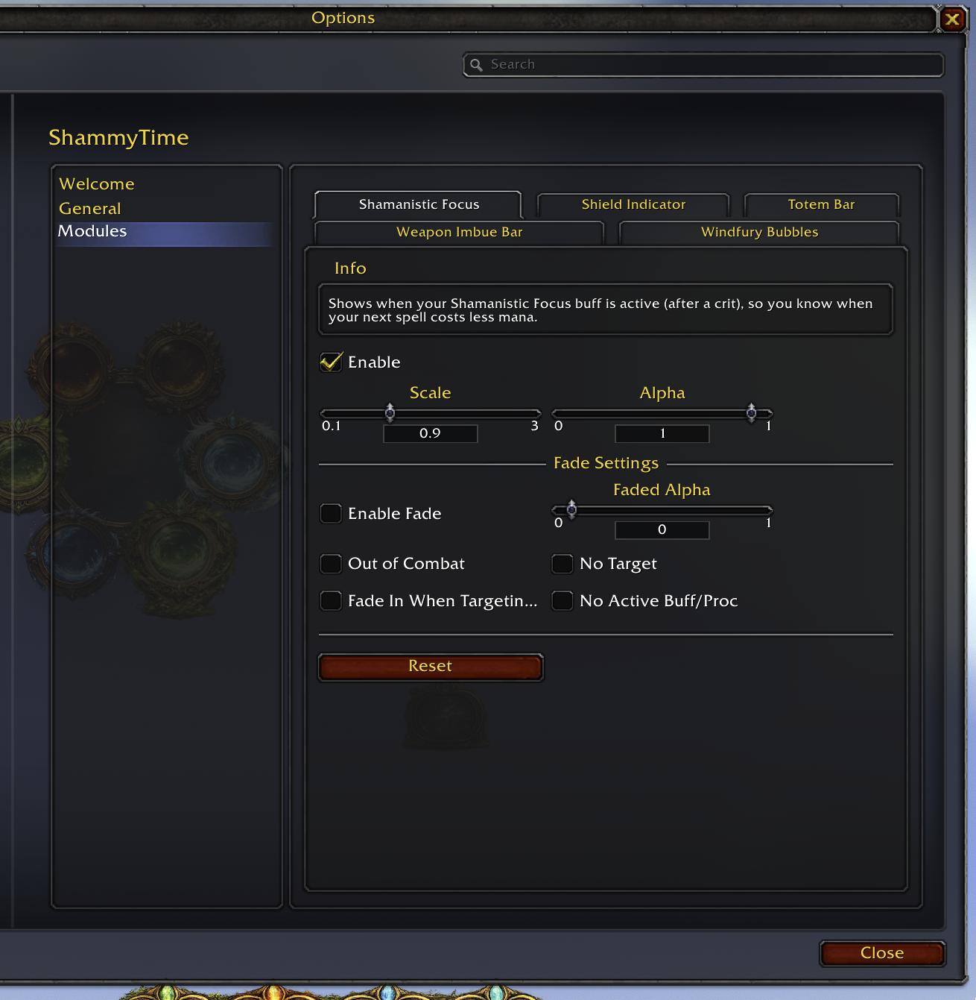
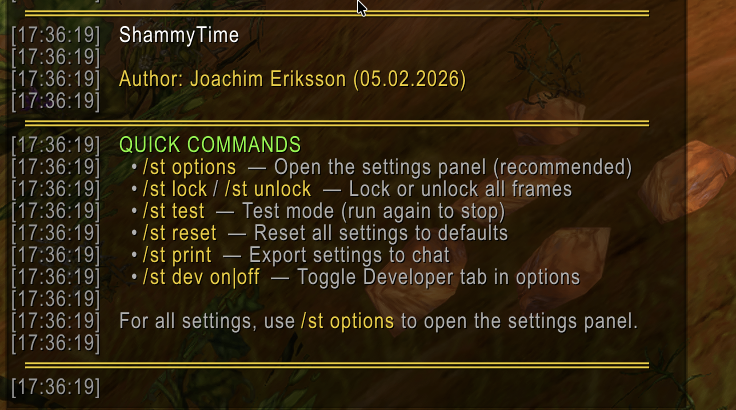

# ShammyTime - Enhancment Shaman Addon for WoW TBC Anniversary
Author: Joachim Eriksson (05.02.2026)

An **Enhancement Shaman** addon for WoW TBC Anniversary that gives you a **Windfury** circle (center ring + stat bubbles), a totem bar with timers, a red overlay when you’re too far from a totem, Lightning/Water Shield, weapon imbue, and Shamanistic Focus.

**Built for The Burning Crusade Anniversary 2026** (Interface 20505). Works with TBC Anniversary clients (Interface 20501–20505).

When the addon loads you’ll see: **ShammyTime loaded.** Type **/st** for information or **/st options** to enter the options panel.

---

## Screenshots

### Windfury Circle

Animated; plays an electric strike on crit. Center shows "Windfury!" and total; satellites show MIN, MAX, AVG, PROCS, PROC%, CRIT%. Numbers on hover or always. Right-click to reset.

  

---

### Totem Bar

Fire, Earth, Water, Air with timers. Red overlay when out of range; "Gone" when a totem dies or expires.

 

---

### Weapon Imbue Bar

Current imbue and time left (Flametongue, Frostbrand, Rockbiter, Windfury Weapon).

---

### Shamanistic Focus

Lights up with a timer after a melee crit; next Shock costs 60% less for 15s.

 

---

### Lightning/Water Shield

Shield charges (and time left where applicable).

 

---

### Settings & Quick Commands

**/st options** opens the panel; **/st** lists slash commands. All elements can be shown/hidden, scaled, and faded in settings.

 

---

## Quick Commands

| Command | Description |
|--------|-------------|
| **/st** | Show addon info and main slash commands. |
| **/st options** | Open the settings panel (recommended). |
| **/st lock** / **/st unlock** | Lock or unlock all frames (drag when unlocked). |
| **/st test** | Test mode (circle, Windfury, focus). Run again to stop. |
| **/st reset** | Reset all settings to defaults. |
| **/st print** | Export current settings to chat. |
| **/st dev on\|off** | Show or hide the Developer tab in options. |

You can use **/shammytime** instead of **/st**.

---

## Installation

### CurseForge

1. Install the [CurseForge app](https://www.curseforge.com/download/app) and add your WoW TBC Anniversary install.
2. Search for **ShammyTime** and install. The app puts it in the right folder.

### Manual

1. Download the latest release or clone this repo.
2. Put the **ShammyTime** folder in:
   - **TBC Anniversary:** `World of Warcraft\_anniversary_\Interface\AddOns\`
3. Restart WoW or `/reload`, and enable **ShammyTime** in the AddOns list at the character screen.

---

## Technical Notes

- **Saved data:** Positions, scales, lock state, and all settings are stored in **ShammyTimeDB** per character. Windfury session and pull stats are saved too.
- **Range overlay:** Totem slots get a red overlay when you’re too far to benefit. **Buff-based:** For totems that put a buff on you (Mana Spring, Strength of Earth, etc.), the overlay shows when the totem is down but you don’t have the buff. **Position-based:** For totems without a player buff (Searing Totem, Windfury Totem, etc.), the addon uses your position when you placed the totem; **position check only works outdoors**, not in instances.
- **Options:** After changing settings in the options panel, type **/reload** so that all options are applied correctly.

---

## License

MIT License. Use and modify as you like; no warranty. If you publish a fork, credit the original. See **LICENSE** in this folder for the full text.
